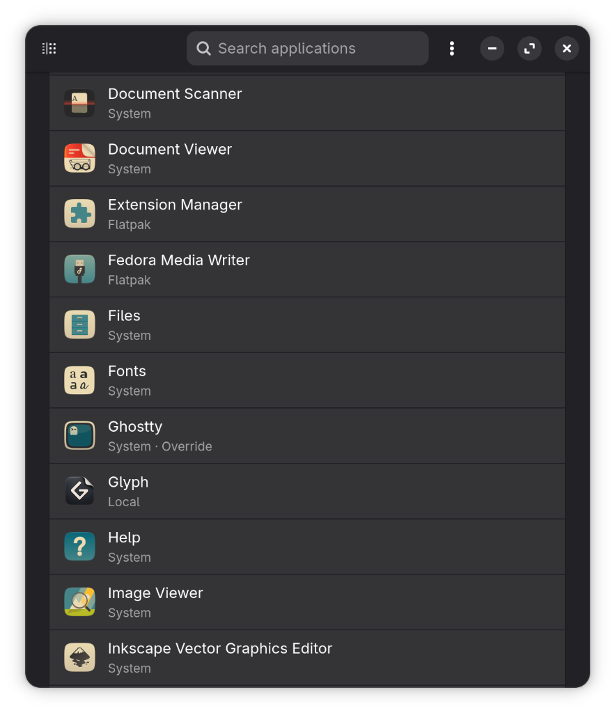
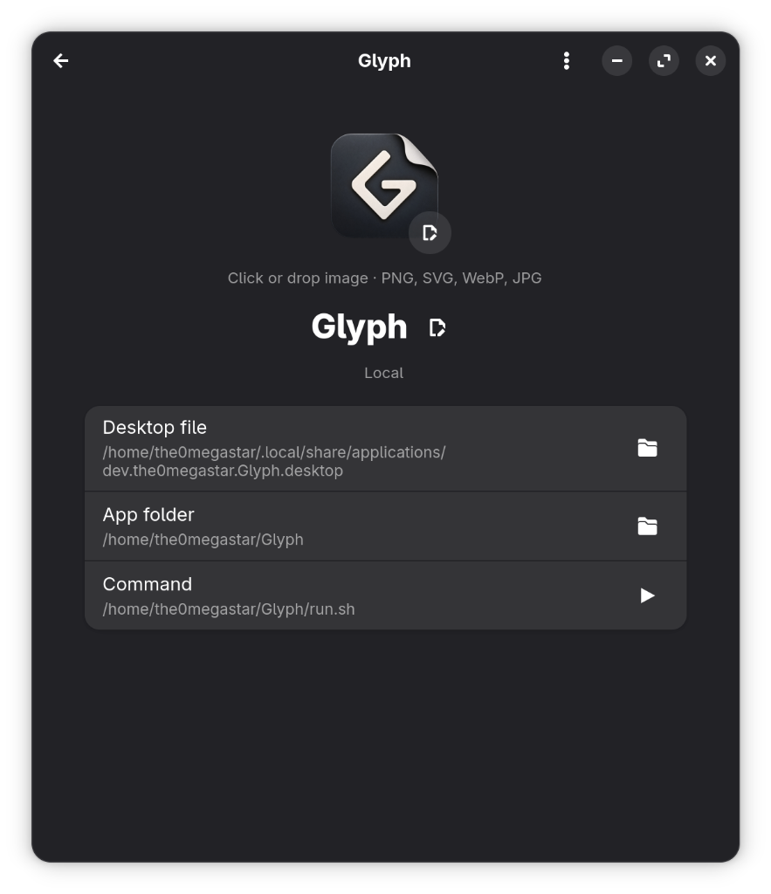

# Glyph

A modern Linux desktop application to browse installed applications, customize launcher icons and display names, and easily restore originals.

<p align="center">
  
  &nbsp;
  
</p>

Glyph never edits system files under `/usr/share/applications` or Flatpak/Snap export directories. It safely creates user-level overrides in `~/.local/share/applications/` (the standard FreeDesktop.org specification), copies customized icons into `~/.local/share/glyph/icons/`, and tracks state to allow clean, non-destructive reversion at any time.

---

## Downloads & Installation

Pre-built binaries are generated for every release supporting both **64-bit PC (`x86_64`)** and **ARM64 (`aarch64`)** (Raspberry Pi 4/5, Apple Silicon with Asahi Linux, and ARM laptops).

👉 **[Download Latest Release](https://github.com/the0megastar/Glyph/releases/latest)**

### 📦 Flatpak Bundle (`.flatpak`) (Recommended)
Works universally on any Linux distribution with Flatpak installed (Ubuntu, Fedora, Arch, Debian, openSUSE, Mint, SteamOS, etc.).

**64-bit PC (Intel / AMD):**
```bash
flatpak install Glyph-*-x86_64.flatpak
```

**ARM64 (Raspberry Pi, Asahi Linux, ARM laptops):**
```bash
flatpak install Glyph-*-aarch64.flatpak
```

### 🚀 AppImage (`.AppImage`)
Standalone executable with bundled Python, GTK, and Libadwaita. Requires glibc 2.39 or newer (Ubuntu 24.04 or a comparable newer distribution) and a working graphical session. No Python or GTK installation required.

[AppImage build and verification instructions](packaging/appimage/README.md).

```bash
chmod +x Glyph-*.AppImage && ./Glyph-*.AppImage
```

### 🐧 Debian / Ubuntu / Linux Mint / Pop!_OS (`.deb`)

```bash
sudo apt install ./glyph-*.deb
```

### 🎩 Fedora / RHEL / openSUSE (`.rpm`)

```bash
sudo dnf install ./glyph-*.rpm
```

### 🏔️ Arch Linux

Install the pre-built pacman package:
```bash
sudo pacman -U ./glyph-*-any.pkg.tar.zst
```

Or build and install directly using the checked-in PKGBUILD:
```bash
cd packaging/aur
makepkg -si
```

---

## Compatibility & Desktop Environments

Glyph is built using GTK4 and Libadwaita, and follows FreeDesktop.org (XDG) standards. It runs across all major desktop environments and Linux distributions:
- **Architectures**: `x86_64` (Intel/AMD) and `aarch64` / `arm64` (Raspberry Pi 4 & 5, Asahi Linux on Apple Silicon, Snapdragon ARM laptops).
- **Desktop Environments**: GNOME, KDE Plasma, COSMIC, Cinnamon, XFCE, MATE, and Wayland/X11 window managers.
- **Distributions**: Fedora, Ubuntu, Debian, Arch Linux, openSUSE, SteamOS, and any system supporting Flatpak or GTK4.

---

## Features

- **App-by-App Icon Customization**: Click "Change icon" or drag and drop any image (`.png`, `.svg`, `.webp`, `.jpg`) directly onto the 96px icon preview.
- **Custom Application Display Names**: Rename any application launcher right from the app page with automatic locale stripping and one-click undo (↺).
- **Customized Filter**: Dropdown menu on the header bar to quickly filter between all installed applications and only those with active customizations.
- **Restore Stock & Revert**:
  - Revert custom icons or reset custom display names independently.
  - For applications with local overrides shadowing system or Flatpak packages, click "Restore system default launcher" to safely remove the local override and restore upstream defaults.
- **App Details & Quick Launch**: Inspect the resolved **App folder**, **Desktop file**, and start **Command** with buttons to open locations in Files, plus a header **Launch** button to test and preview your launcher in the dash immediately.
- **Empty States**: Native `Adw.StatusPage` illustrations when searches yield no matches or when no apps have been customized.
- **Primary Menu**:
  - **Backup & Restore Overrides**: Export or import your customizations as a portable v2 `.tar.gz` bundle for backups or dotfile synchronization across machines.
  - **Reset Overrides Submenu**: Keeps bulk icon, name, and system-default reset actions together and away from routine actions.
  - **Open Data Folder in Files**: Inspect `~/.local/share/glyph/` directly.
  - **Preferences**: Follow the system appearance or force light or dark mode (`Ctrl+,`).
  - **Keyboard Shortcuts**: View built-in shortcuts (`Ctrl+F`, `Ctrl+,`, `Ctrl+Q`, `Ctrl+?`, `Esc`).

---

## Sources

- **System**: Native applications installed system-wide via distro package managers (RPM, DEB, Pacman, etc.) under `/usr/share/applications/`.
- **Flatpak**: Sandboxed Flatpak applications from system or user installations.
- **Snap**: Applications installed via Snap.
- **Local**: Applications installed directly in user space (e.g. `~/.local/bin/` or custom AppImage launchers).

---

## How Revert Works

In Flatpak, launcher overrides are written to the host's applications directory
(`$HOST_XDG_DATA_HOME/applications`, or `~/.local/share/applications`). Glyph's
state and copied icons remain in its private `$XDG_DATA_HOME/glyph` directory.
Native installations continue to use `$XDG_DATA_HOME/glyph` for state and icons.

If a development Flatpak build saved preferences against private launcher copies,
the corrected build preserves those files and reports that recovery is needed.
Use the previous build to export those preferences first (and recover any pending
transaction). Close it, move its `overrides.json` aside for safekeeping, then open
the corrected build and import the backup. Do not discard the old data before
exporting. Old Flatpak transaction journals are never replayed against host launchers.

- If Glyph created the local `.desktop` file, revert **deletes** it so the system or Flatpak entry is used again.
- If you already had a local `.desktop` file, revert restores only the previous `Icon=` value.
- "Restore stock" removes the local `.desktop` override completely so the desktop falls back to the original package.
- Copied images and `~/.local/share/glyph/overrides.json` are cleaned up.

---

## Icon Cache & Desktop Refresh

- **Desktop Refresh**: Changes to icons and display names update immediately on the dock/dash, in application search, and across application menus via kernel `inotify` (tested on GNOME, KDE Plasma, XFCE, COSMIC, and Cinnamon).
- **GNOME Shell App Grid**: Docks and searches update instantly. On certain GNOME Shell versions, the full-screen App Grid may occasionally lag behind due to internal texture caching; logging out and back in will force it to reload.
- Launcher icons are what this app changes. The icon inside a running window’s titlebar is provided by the application process itself and is out of scope.

---

## Security & Permissions

Glyph is engineered from the ground up to protect your system integrity and privacy.

- **100% Offline and Private**  
  Glyph does not connect to the internet, contains zero telemetry, and collects no personal data.

- **Non-Destructive User Space Overrides**  
  Glyph never writes to root or system directories (`/usr`, `/var`, `/etc`). All customizations live strictly inside your personal user profile (`~/.local/share/applications/` and `~/.local/share/glyph/`).

- **Read-Only Host Discovery (`host-os ro`)**  
  Standalone Flatpak packages use read-only host filesystem access exclusively to inspect installed application launchers (`/usr/share/applications`) and their icons. This allows Glyph to discover and customize native RPM, DEB, Pacman, and AUR packages safely without needing root privileges.

- **Flatpak Scoped Access**  
  Read-only access to system and user Flatpak directories (`/var/lib/flatpak` and `~/.local/share/flatpak`) allows reading launcher entries and resolving application assets.

- **Native Desktop Portals**  
  File selection dialogs run through native desktop portals, ensuring the sandbox only receives access to the specific image files you select.

---

## Building from Source

If you want to hack on Glyph, contribute, or build it yourself:

### 1. Install Build Dependencies

#### Fedora / RHEL
```bash
sudo dnf install gtk4-devel libadwaita-devel python3-gobject desktop-file-utils meson ninja-build
```

#### Ubuntu / Debian / Linux Mint
```bash
sudo apt install libgtk-4-dev libadwaita-1-dev python3-gi desktop-file-utils meson ninja-build
```

#### Arch Linux
```bash
sudo pacman -S gtk4 libadwaita python-gobject desktop-file-utils meson ninja
```

### 2. Run Directly from Source (No Installation)

```bash
chmod +x run.sh
./run.sh
```

Or using Meson developer environment:
```bash
meson setup build
meson devenv -C build python3 -m glyph
```

### 3. Install to User Prefix (`~/.local`)

```bash
meson setup build --prefix="$HOME/.local"
meson compile -C build
meson install -C build
```

Update your desktop database and icon caches if needed:
```bash
update-desktop-database ~/.local/share/applications
gtk-update-icon-cache ~/.local/share/icons/hicolor
glib-compile-schemas ~/.local/share/glib-2.0/schemas
```

### 4. Build Local Flatpak

```bash
flatpak-builder --user --install --force-clean build-flatpak io.github.the0megastar.Glyph.yaml
flatpak run io.github.the0megastar.Glyph
```

---

## Documentation & Testing

- **Testing Guide**: [`docs/TESTING.md`](docs/TESTING.md) — Running the 37 automated unit tests, individual test execution, and container packaging tests.
- **Least-Privilege Permissions Audit**: [`docs/PERMISSIONS_AUDIT.md`](docs/PERMISSIONS_AUDIT.md) — Detailed review of Flatpak sandbox boundaries and filesystem grants.
- **Release Notes**: [`releases/v0.1.3.md`](releases/v0.1.3.md) — Feature overview and download links.
- **Post-Implementation Report**: [`docs/POST_IMPLEMENTATION_STATUS.md`](docs/POST_IMPLEMENTATION_STATUS.md) — Defect-by-defect status matrix against all review findings.

---

## Support & Sponsorship

If you find Glyph useful and would like to support its continued development:

[](https://ko-fi.com/the0megastar)
[](https://github.com/sponsors/the0megastar)

---

## License

Glyph is free and open-source software licensed under the [GNU General Public License v3.0](LICENSE).
